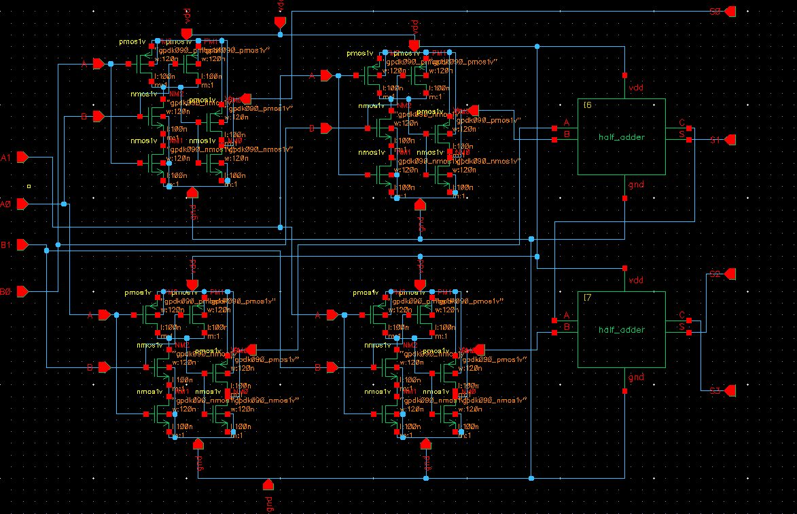
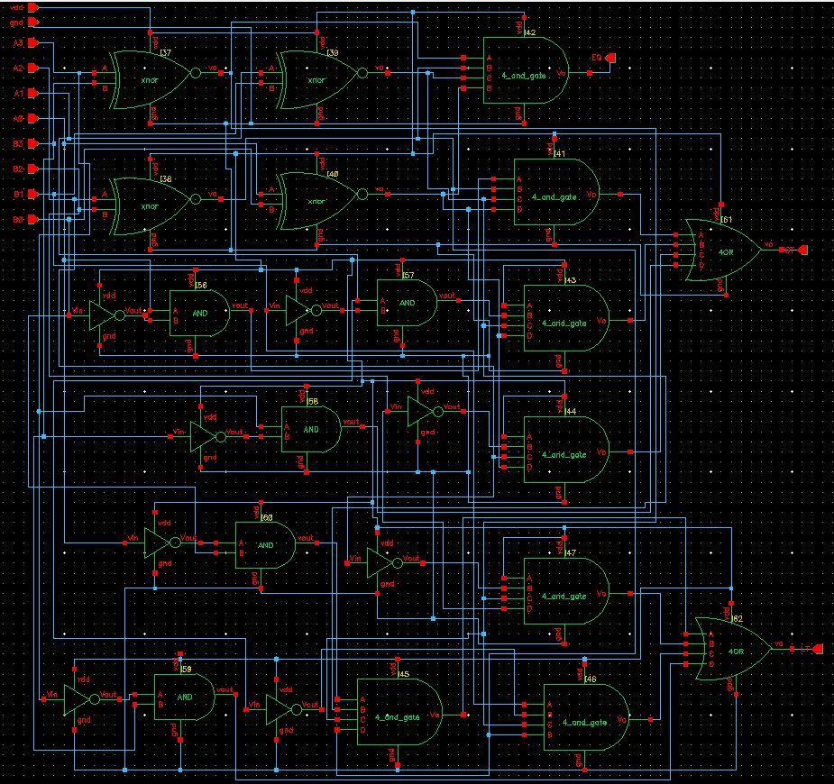
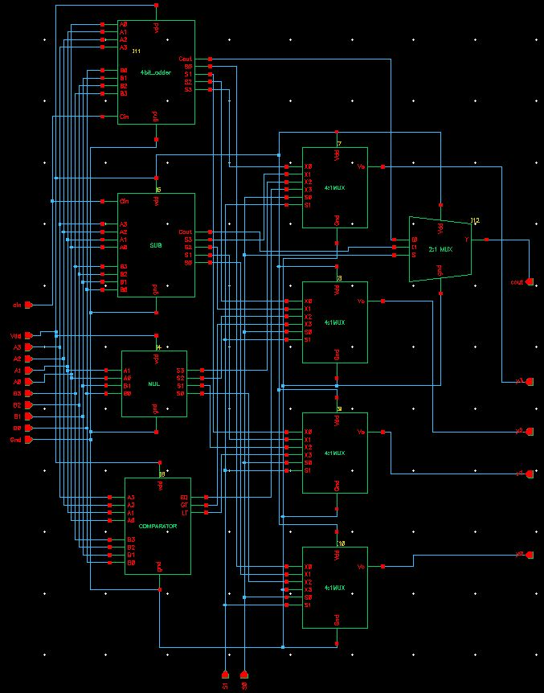
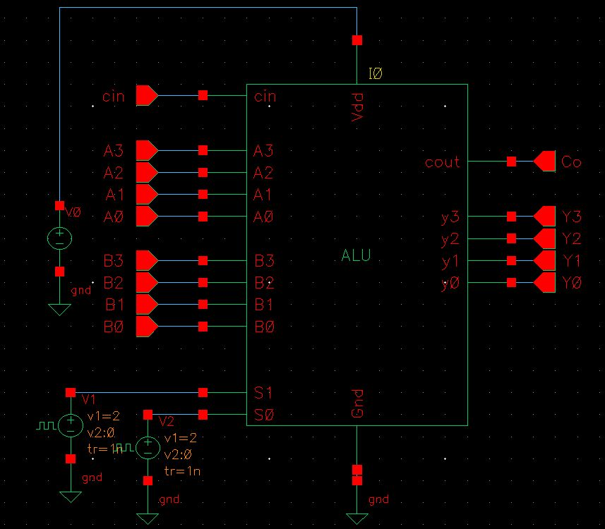
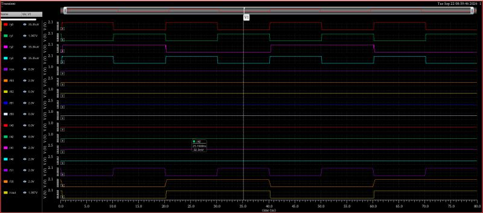

# 4-Bit ALU Design using Cadence Virtuoso

## 📌 Overview

This project presents the design and simulation of a **4-bit Arithmetic Logic Unit (ALU)** using **Cadence Virtuoso**.

The design was developed at the schematic level using CMOS/transistor-level circuit blocks and hierarchical design techniques. The project includes individual circuit blocks, a top-level ALU, symbol creation, and simulation waveform verification.

> **Note:** The original Cadence Virtuoso project files are maintained on the college/server environment. This GitHub repository contains the available design screenshots and simulation results for documentation and portfolio purposes.

---

## ⚙️ Features

- 4-bit ALU design
- CMOS/transistor-level circuit implementation
- Hierarchical schematic design
- Arithmetic and logic operation blocks
- 4-bit adder and subtractor blocks
- Logic operation block
- Comparator block
- Multiplexer-based output selection
- Custom ALU symbol
- Cadence Virtuoso simulation and waveform verification

---

## 🧠 ALU Architecture

The top-level ALU accepts:

### Inputs

- `A3 A2 A1 A0` – 4-bit input A
- `B3 B2 B1 B0` – 4-bit input B
- `Cin` – Carry input
- `S1, S0` – Operation selection inputs
- `VDD` – Supply
- `GND` – Ground

### Outputs

- `Y3 Y2 Y1 Y0` – 4-bit ALU output
- `Cout` – Carry output

The top-level design integrates multiple functional blocks and uses multiplexers to select the required result according to the control inputs.

---

## 🏗️ Functional Blocks

The hierarchical ALU contains the following major blocks:

- 4-bit Adder
- 4-bit Subtractor
- Logic Unit
- Comparator
- Multiplexers for result selection
- Top-level ALU integration

The individual blocks are connected hierarchically to form the complete ALU.

---

## 🔄 Design Flow

```text
Logic Specification
        ↓
Functional Block Design
        ↓
CMOS / Transistor-Level Schematic
        ↓
Gate-Level / Hierarchical Integration
        ↓
Top-Level ALU
        ↓
ALU Symbol Creation
        ↓
Testbench / Input Generation
        ↓
Cadence Virtuoso Simulation
        ↓
Waveform Verification
```

---

## 📂 Project Structure

```text
4-Bit-ALU-Cadence-Virtuoso/
│
├── README.md
│
├── Schematic/
│   ├── transistor_level_schematic.jpg
│   ├── gate_level_schematic.jpg
│   └── top_level_ALU_schematic.jpg
│
├── Symbol/
│   └── ALU_symbol.jpg
│
└── Simulation/
    └── ALU_simulation_waveform.jpg
```

---

## 🔬 Transistor-Level Schematic

The following schematic shows the CMOS/transistor-level implementation of circuit blocks used in the ALU.



---

## 🔧 Gate-Level / Hierarchical Schematic

The circuit blocks are interconnected hierarchically to implement the required arithmetic and logic functions.



---

## 🧩 Top-Level ALU Schematic

The top-level schematic integrates the arithmetic unit, logic unit, comparator and multiplexer-based selection network.



---

## 🔲 ALU Symbol

The custom ALU symbol provides the external interface for the complete 4-bit ALU.



---

## 🧪 Simulation

The ALU was simulated in **Cadence Virtuoso** using input stimulus signals for functional verification.



The waveform shows the applied input/control signals and corresponding ALU output responses over time.

---

## 📊 Inputs and Outputs

| Signal | Description |
|---|---|
| `A3:A0` | 4-bit input operand A |
| `B3:B0` | 4-bit input operand B |
| `Cin` | Carry input |
| `S1:S0` | Operation selection/control inputs |
| `Y3:Y0` | 4-bit ALU output |
| `Cout` | Carry output |
| `VDD` | Positive supply |
| `GND` | Ground |

---

## 🛠️ Tools Used

- **Cadence Virtuoso**
- CMOS / Transistor-Level Circuit Design
- Schematic Editor
- Hierarchical Circuit Design
- Circuit Simulation
- Waveform Viewer

---

## ✅ Verification

The simulation waveform was used to verify the response of the ALU for different combinations of input operands and control signals.

The available simulation screenshot demonstrates the relationship between the applied inputs, selection signals and resulting ALU outputs.

---

## 🚀 Future Work

The current repository documents the schematic and simulation stage of the design.

Possible future extensions include:

- Full custom layout implementation
- Design Rule Check (DRC)
- Layout Versus Schematic (LVS)
- Parasitic extraction
- Post-layout simulation
- Power analysis
- Propagation-delay analysis
- Area optimization
- PVT analysis

> These steps are listed as future work and are not claimed as completed in this repository.

---

## 🎯 Conclusion

This project demonstrates the design of a **4-bit ALU using Cadence Virtuoso**, covering CMOS/transistor-level circuit design, hierarchical schematic integration, symbol creation and simulation-based functional verification.

It provides practical exposure to **VLSI circuit design and Cadence Virtuoso simulation workflows**.

---

## 👨‍💻 Author

**Arya Biswas**

Electronics Engineering Student  
NIELIT Aurangabad

---

## 📜 License

This project is intended for educational and academic portfolio purposes.
