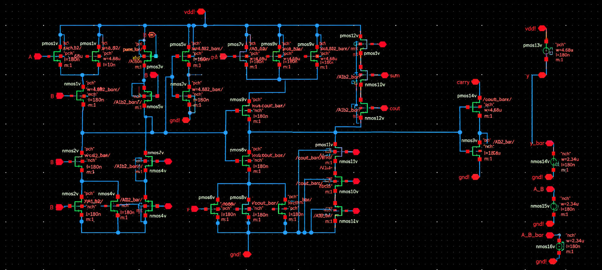
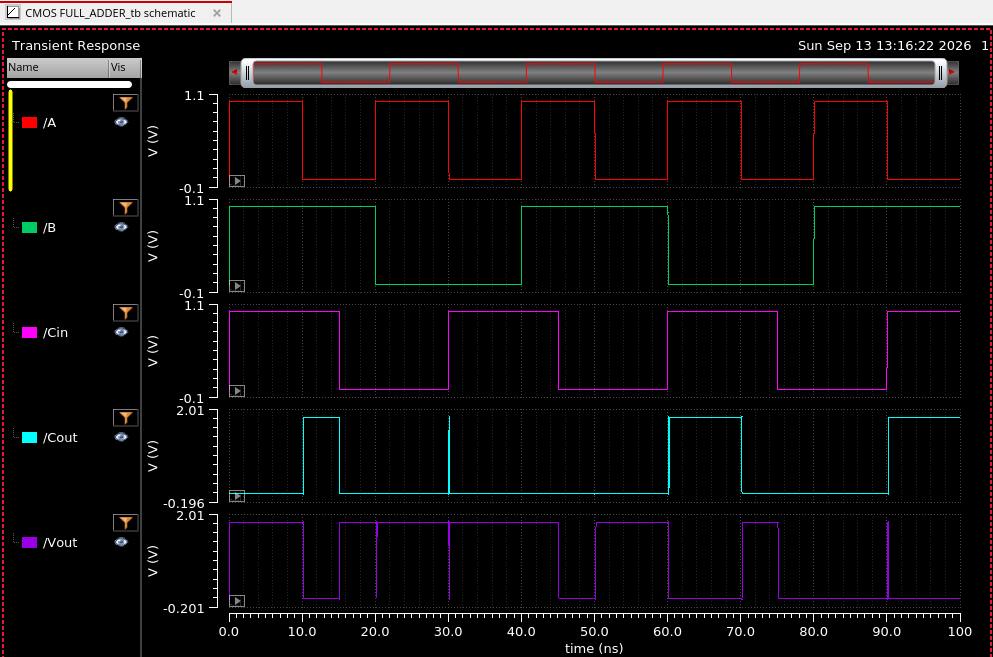

# CMOS Full Adder Design using Cadence Virtuoso

## 📌 Overview

This project presents the design and transient simulation of a **CMOS Full Adder** using **Cadence Virtuoso**.

The circuit is implemented at the transistor level using CMOS PMOS and NMOS devices. It accepts two one-bit inputs and a carry input and produces the corresponding **Sum** and **Carry-out** outputs.

> **Note:** The original Cadence Virtuoso project files are maintained on the college/server environment. This repository contains the available schematic and simulation screenshots for documentation and portfolio purposes.

---

## ⚙️ Features

- CMOS transistor-level Full Adder
- PMOS and NMOS based circuit implementation
- Inputs: `A`, `B`, `Cin`
- Outputs: `Sum`, `Cout`
- Cadence Virtuoso schematic design
- Transient simulation and waveform verification

---

## 🧠 Full Adder Logic

A full adder performs:

```text
A + B + Cin
```

The logic equations are:

```text
Sum  = A ⊕ B ⊕ Cin

Cout = AB + ACin + BCin
```

---

## 🔌 Inputs & Outputs

| Signal | Description |
|---|---|
| `A` | First 1-bit input |
| `B` | Second 1-bit input |
| `Cin` | Carry input |
| `Sum` | Full-adder sum output |
| `Cout` | Carry output |
| `VDD` | Positive supply |
| `GND` | Ground |

---

## 🏗️ Circuit Structure

```text
        A ─────┐
               │
        B ─────┼──► CMOS Full Adder ───► Sum
               │
       Cin ────┘
                         │
                         └─────────────► Cout
```

The transistor-level circuit uses PMOS and NMOS networks to implement the required logic.

---

## 🔬 Transistor-Level Schematic



---

## 🧪 Transient Simulation

The circuit was simulated using transient analysis in Cadence Virtuoso. The input waveforms `A`, `B`, and `Cin` are varied with time, and the resulting `Sum` and `Cout` waveforms are observed.



---

## 📊 Truth Table

| A | B | Cin | Sum | Cout |
|---:|---:|---:|---:|---:|
| 0 | 0 | 0 | 0 | 0 |
| 0 | 0 | 1 | 1 | 0 |
| 0 | 1 | 0 | 1 | 0 |
| 0 | 1 | 1 | 0 | 1 |
| 1 | 0 | 0 | 1 | 0 |
| 1 | 0 | 1 | 0 | 1 |
| 1 | 1 | 0 | 0 | 1 |
| 1 | 1 | 1 | 1 | 1 |

---

## 🛠️ Tools Used

- **Cadence Virtuoso**
- CMOS transistor-level schematic design
- PMOS / NMOS circuit design
- Transient analysis
- Cadence waveform viewer

---

## 🔄 Design Flow

```text
Full Adder Logic
       ↓
CMOS Logic Design
       ↓
PMOS / NMOS Transistor Implementation
       ↓
Cadence Virtuoso Schematic
       ↓
Transient Simulation
       ↓
Waveform Verification
```

---

## 📂 Project Structure

```text
4-Bit-CMOS-Full-Adder-Cadence-Virtuoso/
│
├── README.md
│
├── Schematic/
│   └── CMOS_full_adder_transistor_level.png
│
└── Simulation/
    └── CMOS_full_adder_transient_waveform.png
```

---

## ✅ Result

The CMOS Full Adder was designed at the transistor level and simulated using Cadence Virtuoso. The transient waveform was used to observe the response of `Sum` and `Cout` for changing combinations of `A`, `B`, and `Cin`.

---

## 🚀 Future Work

- Layout implementation
- Design Rule Check (DRC)
- Layout Versus Schematic (LVS)
- Parasitic extraction
- Post-layout simulation
- Propagation-delay analysis
- Power analysis
- PVT analysis
- Cascading multiple full adders to create a 4-bit ripple-carry adder

> These are future-work items and are not claimed as completed in this repository.

---

## 🎯 Conclusion

This project demonstrates a **CMOS transistor-level Full Adder designed and simulated using Cadence Virtuoso**, providing practical experience in transistor-level digital circuit design, CMOS logic implementation, schematic development, and transient waveform verification.

---

## 👨‍💻 Author

**Arya Biswas**

Electronics Engineering Student  
NIELIT Aurangabad

---

## 📜 License

This project is intended for educational and academic portfolio purposes.
